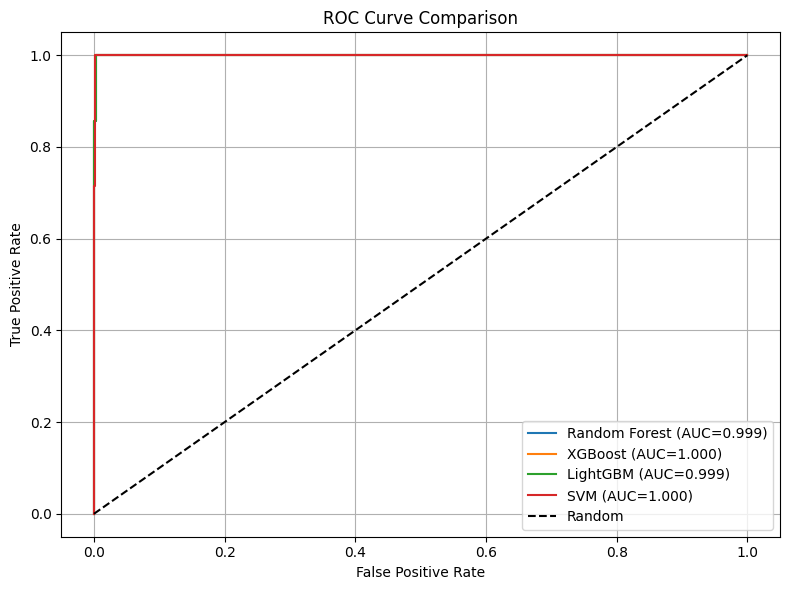
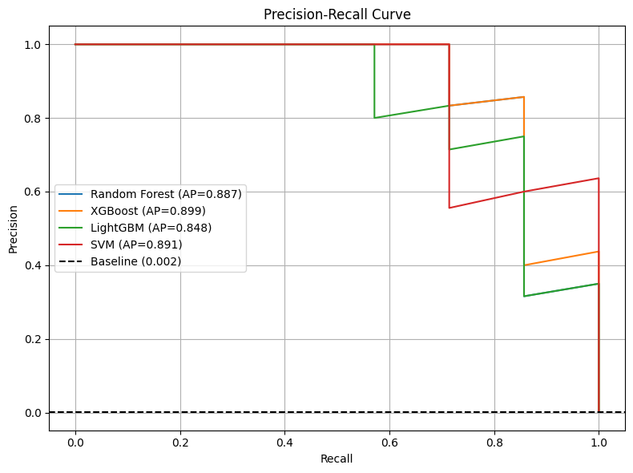

# 💳 Advanced Credit Card Fraud Detection

### 🚀 Cost-Sensitive Machine Learning Framework for Real-World Fraud Detection


---

## 📌 Overview

This project presents a **research-driven machine learning framework** for detecting fraudulent credit card transactions in highly imbalanced datasets.

Traditional fraud detection systems rely heavily on accuracy, which becomes misleading in extreme imbalance scenarios. This work instead formulates fraud detection as an **Expected Risk Minimization problem**, ensuring that predictions are aligned with **real-world financial loss rather than statistical metrics alone**.

---

## 🚀 Key Highlights

* Controlled SMOTE (0.2 ratio) to prevent overfitting
* Domain-driven Feature Engineering (Temporal + Log Scaling)
* Cost-Sensitive Learning with asymmetric penalties
* Ensemble Learning: XGBoost, Random Forest, LightGBM
* Robust evaluation using PR-AUC, ROC-AUC, F1-Score, and Financial Cost

---

## 📊 Dataset

The dataset used is publicly available:

👉 https://www.kaggle.com/datasets/mlg-ulb/creditcardfraud

### 📌 Dataset Details

* Total Transactions: **284,807**
* Fraud Cases: **492 (~0.17%)**
* Features: **V1–V28 (PCA), Time, Amount**

⚠️ Dataset is not included due to size and licensing constraints.

---

## 🧠 Methodology

### 1. Feature Engineering

* Extracted **Hour** from transaction time
* Generated **Is_Night** indicator
* Applied **log transformation** to normalize transaction amount
* Created relational feature interactions

---

### 2. Handling Class Imbalance

* Implemented **Controlled SMOTE (0.2 ratio)**
* Preserves minority structure while avoiding synthetic boundary overlap

---

### 3. Models Evaluated

* XGBoost (**Best Performing**)
* Random Forest
* LightGBM
* Support Vector Machine
* Isolation Forest (baseline anomaly detection)

---

### 4. Cost-Sensitive Framework

Financial loss function:

Cost = (FN × 500) + (FP × 10)

* False Negative → Severe financial loss
* False Positive → Minor operational cost

---

## ⚡ Performance Summary

* Best Model: **XGBoost**
* F1 Score: **0.857**
* PR-AUC: **0.899**
* Financial Cost Reduction: **~49% vs Random Forest**

---

## 📈 Results

| Model            | Precision | Recall    | F1 Score  | Cost ($) |
| ---------------- | --------- | --------- | --------- | -------- |
| Random Forest    | 1.000     | 0.714     | 0.833     | 1000     |
| **XGBoost**      | **0.857** | **0.857** | **0.857** | **510**  |
| LightGBM         | 0.714     | 0.714     | 0.714     | 1020     |
| SVM              | 0.833     | 0.714     | 0.769     | 1010     |
| Isolation Forest | 0.043     | 0.142     | 0.066     | 3220     |

---

## 📉 Visualizations

### ROC Curve



### Precision-Recall Curve



---

## ▶️ How to Run

```bash
git clone https://github.com/KenishHirpara/fraud-detection-ml.git
cd fraud-detection-ml
pip install -r requirements.txt
python model.py
```

⚠️ Replace `sample_data.csv` with the full dataset for actual results.

---

## 🔁 Reproducibility

To reproduce results:

1. Download dataset from Kaggle
2. Place dataset in project directory
3. Run notebook or script

All preprocessing, training, and evaluation steps are included.

---

## 🧪 Experimental Setup

* Train/Test Split: 80/20 (Stratified)
* SMOTE Ratio: 0.2
* Evaluation Metrics: F1, PR-AUC, ROC-AUC
* Cost Function: FN = 500, FP = 10

---

## 🌍 Real-World Relevance

* Designed for banking fraud detection systems
* Handles extreme class imbalance
* Optimized for financial risk rather than accuracy
* Suitable for real-time deployment pipelines

---

## 🧠 Research Insight

Fraud detection should be treated as an **asymmetric risk minimization problem**, not a traditional classification task.

---

## ⚠️ Limitations

* PCA features reduce interpretability
* Synthetic samples from SMOTE
* Static model (no real-time concept drift handling)

---

## 🔮 Future Work

* Deep learning models (LSTM, Transformers)
* Real-time fraud detection pipelines
* Concept drift adaptation
* Adversarial robustness

---

## 📜 Research Paper

The full IEEE-style research paper is included in this repository.

---

## 👨‍💻 Author

**Kenish Hirpara**

---

## ⭐ Support

If you found this project useful, consider giving it a ⭐ on GitHub!
